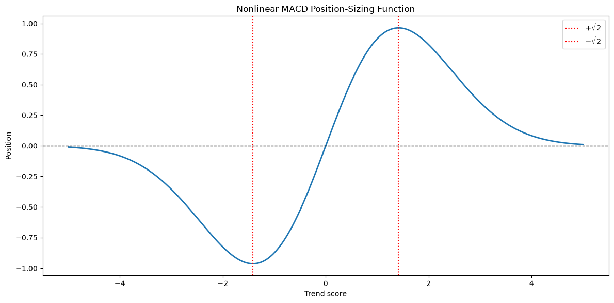
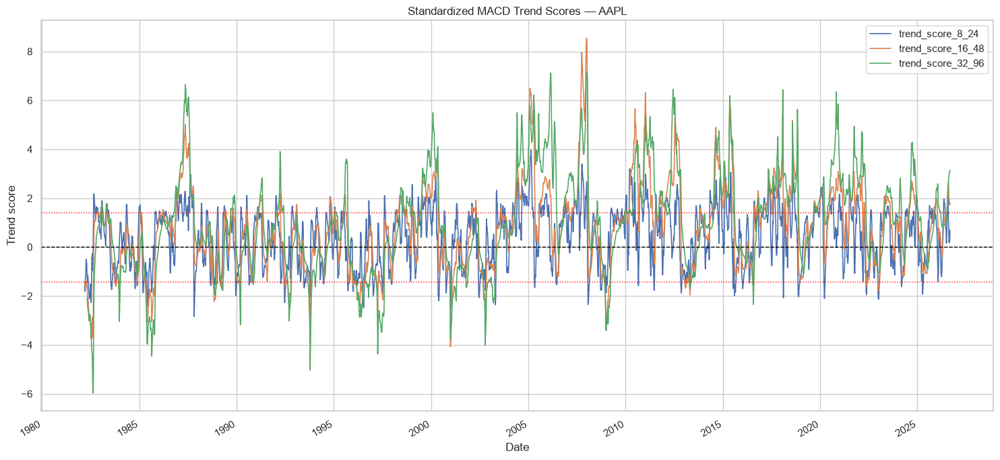
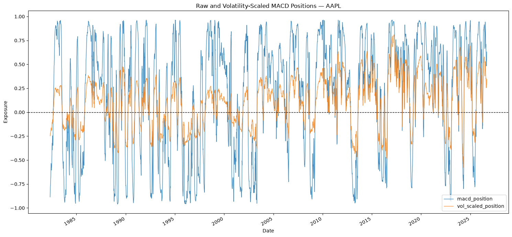
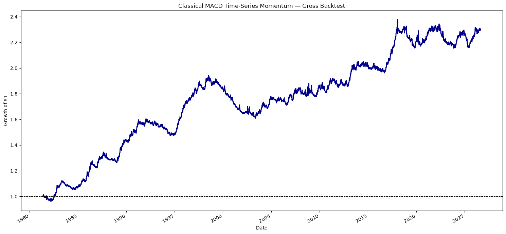
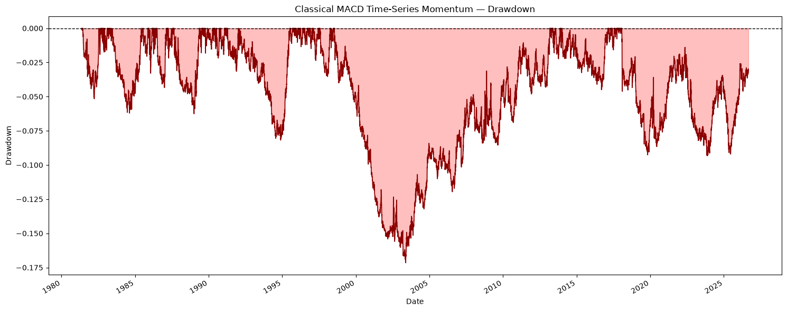
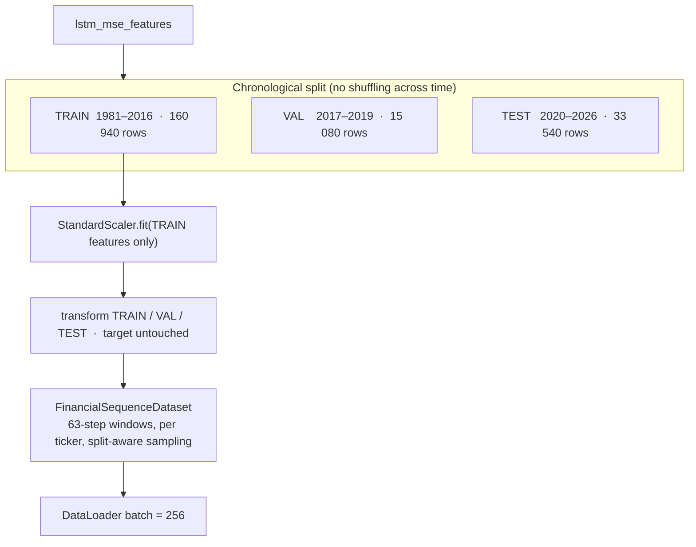
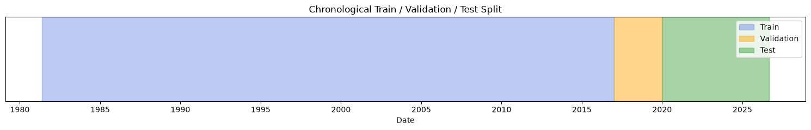
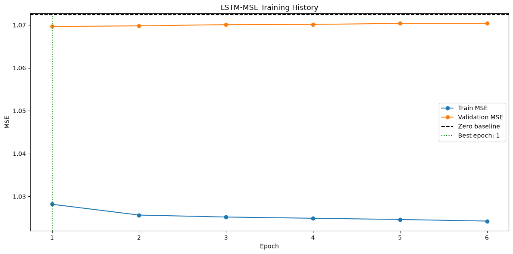
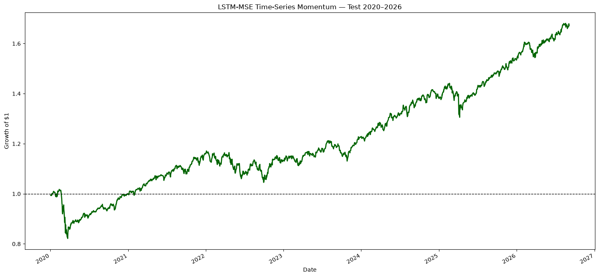

# Time-Series Momentum — Classical MACD vs. Deep Momentum Network (LSTM-MSE)

> **A research-grade, leakage-free implementation of time-series momentum on 46 years of US equity data — from raw prices to a fully back-tested Deep Momentum Network.**
> Two strategies are built end-to-end and compared on the *exact same* universe, features and portfolio-construction rules:
>
> 1. **Classical MACD trend-following** — the Baz *et al.* (2015) volatility-normalised MACD signal with a non-linear response function.
> 2. **LSTM-MSE Deep Momentum Network** — a recurrent neural network trained to forecast the volatility-scaled next-day return, in the spirit of Lim, Zohren & Roberts (2019).

<p align="center">
  
  
  
  
  
  
</p>

---

## Table of contents

- [1. Executive summary](#1-executive-summary)
- [2. Research background & the equations we implement](#2-research-background--the-equations-we-implement)
- [3. Repository layout](#3-repository-layout)
- [4. The data layer](#4-the-data-layer)
- [5. Pipeline A — Classical MACD time-series momentum](#5-pipeline-a--classical-macd-time-series-momentum)
- [6. Pipeline B — LSTM-MSE Deep Momentum Network](#6-pipeline-b--lstm-mse-deep-momentum-network)
- [7. Back-test engine & anti-look-ahead discipline](#7-back-test-engine--anti-look-ahead-discipline)
- [8. Results](#8-results)
- [9. Honest discussion & limitations](#9-honest-discussion--limitations)
- [10. Reproducibility](#10-reproducibility)
- [11. Roadmap](#11-roadmap)
- [12. References](#12-references)
- [Appendix — notebook-by-notebook walkthrough](#appendix--notebook-by-notebook-walkthrough)

---

## 1. Executive summary

| | **Classical MACD** | **LSTM-MSE DMN** |
|---|---|---|
| Signal | Analytic: volatility-normalised MACD → non-linear sizing `φ(y)` | Learned: LSTM point-forecast of vol-scaled next-day return, `position = sign(ŷ)` |
| Features | 3 MACD trend scores `(8/24, 16/48, 32/96)` | 5 momentum horizons + 3 MACD trend scores + annualised vol (**9 features**) |
| Look-back | Recursive EWMA (infinite memory) | Rolling window of **63 trading days** |
| Trainable parameters | 0 (closed form) | **5 537** |
| Portfolio construction | identical: `w = (σ_target / σ) · signal / Nₜ`, `σ_target = 15 %`, equal risk, **T+1 execution** | identical |
| Evaluation window | 1981-05-18 → 2026-09-04 (**11 418** days, gross) | Out-of-sample **2020-01-03 → 2026-09-04** |
| Growth of \$1 | **2.30×** (+130.2 %) | **1.67×** (+67.2 %) over the 6.7-year test |
| Annualised Sharpe | **0.52** (Sortino 0.72, Calmar 0.11, MaxDD −17.2 %) | — (test-window wealth curve only) |
| Directional accuracy | — | **52.1 %** (test) |
| Honest verdict | A textbook, positive-Sharpe trend book | **The MSE model barely beats a zero-forecast baseline** (see §9) — a deliberately reported negative result |

The point of the project is **not** to claim a market-beating neural network. It is to build a *correct* research stack — reproducible data, leakage-free features, chronological splits, a scaler fitted on training data only, T+1 execution, and assertion-guarded every step — and then let the numbers speak, including when they say *"a plain MSE loss is the wrong objective for trading"*.

---

## 2. Research background & the equations we implement

Time-series (a.k.a. *trend-following*) momentum buys assets that have gone up and sells assets that have gone down, sizing each position by its own risk. This repo implements the modern, volatility-normalised formulation and then asks whether a sequence model can improve on it.

### 2.1 Intermediate signal — volatility-normalised MACD (Baz *et al.*, 2015)

Exponentially-weighted moving average with time-scale `S` (`α = 1/S`, causal, `min_periods = S`):

$$m_t(S) = \left(1 - \tfrac{1}{S}\right) m_{t-1}(S) + \tfrac{1}{S}\, P_t$$

Raw MACD for a short/long pair `(S, L)`:

$$\text{MACD}_t(S, L) = \text{EWMA}_t(S) - \text{EWMA}_t(L)$$

Normalise by 63-day rolling price volatility, then standardise by the signal's own 252-day rolling volatility to obtain the **trend score**:

$$q_t(S,L) = \frac{\text{MACD}_t(S,L)}{\operatorname{Std}\big(P_{t-62}, \dots, P_t\big)}
\qquad
Y_t(S,L) = \frac{q_t(S,L)}{\operatorname{Std}\big(q_{t-251}, \dots, q_t\big)}$$

Three pairs are used: **(8, 24), (16, 48), (32, 96)**.

### 2.2 Non-linear position response

Each trend score is passed through the response function of Baz *et al.* / Lim *et al.*:

$$\phi(y) = \frac{y \, \exp\!\big(-y^{2}/4\big)}{0.89}$$

It is monotone-increasing up to `|y| = √2 ≈ 1.414` (where `|φ| ≈ 0.964`), then **decays** — an over-extended trend is *de-risked*, not chased. The classical strategy averages the three sized signals:

$$X_t^{(i)} = \frac{1}{3}\sum_{(S,L)} \phi\big(Y_t^{(i)}(S,L)\big)$$

<p align="center">
  
</p>

### 2.3 Volatility targeting & portfolio weights

Annualised ex-ante volatility from a 60-day half-life EWMA of daily returns:

$$\sigma_t = \sqrt{252}\;\; \text{EWMA-Std}_{\text{hl}=60}(r_t)$$

Portfolio weight per asset, with an annual **volatility target of 15 %** and equal risk budgeting across the `Nₜ` assets live on date `t`:

$$w_t^{(i)} = \frac{1}{N_t}\, X_t^{(i)}\, \frac{\sigma_{\text{target}}}{\sigma_t^{(i)}}, \qquad \sigma_{\text{target}} = 0.15$$

The realised strategy return uses **yesterday's** weight (no look-ahead):

$$r_t^{\text{strat}} = \sum_i w_{t-1}^{(i)} \, r_t^{(i)}$$

### 2.4 The learning variant (Pipeline B)

Instead of the analytic `X_t`, an LSTM maps a 63-day sequence of 9 features to a forecast of the **volatility-scaled next-day return**

$$\tilde{r}_{t+1}^{(i)} = \frac{r_{t+1}^{(i)}}{\sigma_{\text{daily},t}^{(i)}}, \qquad
\mathcal{L} = \operatorname{MSE}\big(\hat{\tilde r}, \tilde r\big)$$

and trades `position = sign(ŷ)`, then feeds that position through the *same* volatility-targeting and `1/Nₜ` machinery of §2.3. This is the simplest member of the "Deep Momentum Network" family — the MSE loss is a baseline; a Sharpe-ratio loss is the natural next step (see §11).

---

## 3. Repository layout

```
Time_series_momentum/
│
├── Data_importation/
│   └── data_impo.ipynb              # 00 · download, clean & quality-check 20 tickers (1980–2026)
│
├── time_series_M_classic/           # ── Pipeline A: analytic MACD strategy ──
│   ├── 02_features_engineering_mcd.ipynb   # EWMA → MACD → q → trend score Y ; 60d EWMA vol ; long panel
│   └── 03_app_calling_feature.ipynb        # φ(y) sizing → vol target → 1/N → T+1 back-test → metrics
│
├── LSTM_MSE/                         # ── Pipeline B: Deep Momentum Network ──
│   ├── 01_features_engineering.ipynb       # 5 momentum horizons + 3 MACD scores + vol ; vol-scaled target
│   ├── 02_LSTM_model.ipynb                 # chrono split → StandardScaler → sequence Dataset → LSTM → train
│   └── 03_backtest_best_model.ipynb        # load best checkpoint → OOS inference → same portfolio rules
│
├── data/processed/                  # generated artefacts (git-ignored)
│   ├── adjusted_close_prices.csv / daily_returns.csv / data_quality_report.csv
│   ├── classical_macd_features.{csv,parquet}      # 235 300 rows × 20 cols
│   ├── lstm_mse_features.{csv,parquet}            # 209 560 rows × 15 cols
│   └── lstm_mse_{train,validation,test}_scaled.parquet
│
├── models/
│   ├── lstm_mse_best_model.pt              # checkpoint + hyper-params + feature list + baseline MSE
│   └── lstm_mse_standard_scaler.joblib     # scaler fitted on TRAIN ONLY
│
├── results/
│   ├── classical_macd_daily_backtest.csv  # daily returns, wealth index, drawdown
│   └── strategy_comparison_metrics.csv    # Sharpe / Sortino / Calmar / MaxDD / …
│
├── picture_analysis/                # all figures referenced in this README
├── pyproject.toml / uv.lock / .python-version   # uv-managed env, pinned, CUDA 13.0 wheels
└── requirment.txt                  # plain-pip fallback list
```

Run order: `data_impo` → (`02`, `03` classic) and/or (`01`, `02`, `03` LSTM).

---

## 4. The data layer

**Source.** Daily bars from Yahoo Finance (`yfinance`, `auto_adjust=True`, `repair=True`), **1980-01-01 → 2026-09-08**.

**Universe.** 20 large-cap US names, chosen for sector spread and long history:

| Sector | Tickers |
|---|---|
| Technology | AAPL, MSFT, AMZN, GOOGL |
| Financials | JPM, BAC, GS |
| Energy | XOM, CVX |
| Healthcare | JNJ, PFE, UNH |
| Industrials | CAT, BA, GE |
| Consumer | WMT, KO, PG, MCD, NKE |

**Cleaning & quality gate** (`data_impo.ipynb`):

- MultiIndex-safe extraction of adjusted closes; timezone stripped; duplicated dates dropped; non-positive prices → `NaN`.
- A **listing-aware quality report** separates *leading* NaNs (not yet listed), *internal* NaNs (real gaps) and *trailing* NaNs (delisted). Only **active-period coverage ≥ 99.5 %** is required.
- Result: **11 765 trading days × 20 tickers, all 20 retained, 0 internal gaps.** First real quote ranges from 1980-01-02 (BA, KO, XOM…) to 2004-08-19 (GOOGL).
- Daily simple returns via `pct_change` with `fill_method=None` (no silent forward-fill), `±inf → NaN`.

Outputs: `adjusted_close_prices.csv`, `daily_returns.csv`, `data_quality_report.csv`, plus a base-1 normalised price chart.

---

## 5. Pipeline A — Classical MACD time-series momentum

### 5.1 Feature engineering — `time_series_M_classic/02_features_engineering_mcd.ipynb`


- Causal `compute_ewma` (`adjust=False`, `min_periods = time_scale`), guarded `short < long`.
- Three-stage normalisation (§2.1) → `trend_score_{8_24, 16_48, 32_96}`.
- Wide `date × ticker` matrices are melted to a **balanced long panel** and merged on `(date, ticker)`.
- **Anti-leakage assertions**: monotone dates, unique `(date, ticker)`, and *no* `forward_return` / `position` / `strategy_return` column is allowed to exist at feature-build time.
- Output: `classical_macd_features.{csv,parquet}` — **235 300 rows × 20 columns**.

<p align="center">
  
</p>

### 5.2 Signal → portfolio → back-test — `time_series_M_classic/03_app_calling_feature.ipynb`


Key facts captured by the notebook's own `assert`s and prints:
- `macd_position ∈ [−1, 1]`, sign preserved through vol-scaling (**0 unexpected direction flips**).
- Long/short mix over the full sample: **68.6 % long / 31.4 % short**.
- `Nₜ` grows from 12 (1981) to 20 assets; mean 18.5.
- Strategy-ready rows after dropping warm-up NaNs: **209 580**.
- Gross back-test **1981-05-18 → 2026-09-04, 11 418 daily observations**.

| | Raw vs. vol-scaled position (AAPL) | Gross wealth curve | Drawdown |
|---|---|---|---|
| |  |  |  |

Artefacts: `results/strategy_comparison_metrics.csv`, `results/classical_macd_daily_backtest.csv`.

---

## 6. Pipeline B — LSTM-MSE Deep Momentum Network

### 6.1 Feature & target engineering — `LSTM_MSE/01_features_engineering.ipynb`

**9 input features per (date, ticker):**

| Group | Columns | Definition |
|---|---|---|
| Multi-horizon momentum | `momentum_{1,21,63,126,252}d` | `Pₜ / Pₜ₋ₕ − 1`, divided by `√h · σ_daily` (risk-normalised) |
| MACD trend scores | `macd_{8_24, 16_48, 32_96}` | same three-stage normalisation as Pipeline A |
| Risk state | `annualized_volatility` | `√252 · EWMA-Std₆₀(r)` |

**Target** (regression): `target_next_return = rₜ₊₁ / σ_daily,ₜ` — the volatility-scaled next-day return. A dedicated assertion reconstructs the target from `daily_return.shift(-1) / daily_volatility` and checks `np.allclose`.

After dropping warm-up rows: **209 560 rows × 15 columns**, per-ticker histories from 5 200 (GOOGL) to 11 418 (BA, KO, …) observations. Saved as `lstm_mse_features.{csv,parquet}`.

### 6.2 Split, scale, sequence — `LSTM_MSE/02_LSTM_model.ipynb`



<p align="center">
  
</p>

- **`FinancialSequenceDataset`** groups by ticker, sorts by date, builds every length-63 window whose *end date* falls in the requested split — so a validation/test window may *look back* into earlier data but is only *scored* on its own era. Sequence tensor shape `(63, 9)`; scalar target.
- Sequences produced: **train 159 700 · val 15 080 · test 33 540**.
- Scaler persisted to `models/lstm_mse_standard_scaler.joblib`; scaled splits cached as parquet.
- Post-scaling report confirms train mean ≈ 0 / std ≈ 1 and shows the mild distribution shift into val/test (e.g. `annualized_volatility` test std ≈ 0.78).

### 6.3 Architecture & training

```
LSTMMSEModel(
  lstm         : nn.LSTM(input_size=9, hidden_size=32, num_layers=1, batch_first=True)
  dropout      : nn.Dropout(p=0.20)          # applied to the last hidden state
  output_layer : nn.Linear(32 → 1)
)                                             #  → squeeze to (batch,)
Total trainable parameters: 5 537
```

| Hyper-parameter | Value |
|---|---|
| Loss / optimiser | `MSELoss` / `Adam(lr = 1e-3, weight_decay = 1e-5)` |
| Gradient clipping | `clip_grad_norm_(max_norm = 1.0)` |
| Batch size / sequence length | 256 / 63 |
| Max epochs / early-stopping patience | 30 / 5 (restore best state) |
| Seed | 42 (`random`, `numpy`, `torch`, `cuda`) |
| Device | CUDA — NVIDIA GeForce RTX 3080, ≈ 4 s/epoch |
| **Zero-forecast baseline** (val) | `mean(target²) = 1.072372` |

Training stopped at **epoch 6**, best at **epoch 1** with **validation MSE 1.069667** — a **+0.25 %** relative improvement over predicting zero. The checkpoint bundles the state dict, every hyper-parameter, the feature list and both baseline MSEs for a self-describing reload.

<p align="center">
  
</p>

### 6.4 Out-of-sample back-test — `LSTM_MSE/03_backtest_best_model.ipynb`

- Rebuilds the architecture from the checkpoint, reloads the **train-only** scaler, and runs inference on every test window.
- A `realization_date` map (`next_date_mapping`) attaches each signal to the **next** trading day; the realised return is reconstructed as `target_normalized_return × daily_volatility` and booked on the realisation date — a second, independent guarantee against look-ahead.
- `position = sign(ŷ)` → same `σ_target / σ` scaling → same `1/Nₜ` equal-risk weighting as Pipeline A.

Out-of-sample diagnostics (2020-01-02 → 2026-09-03 signals):

| Metric | Value |
|---|---|
| Test MSE (LSTM) | 1.084074 |
| Test MSE (zero baseline) | 1.083206 |
| Relative improvement | **−0.08 %** |
| Directional accuracy | **52.08 %** |
| Position mix | **99.7 % long / 0.3 % short** |
| Growth of \$1 (2020-01-03 → 2026-09-04) | **1.6716 (+67.16 %)** |

<p align="center">
  
</p>

---

## 7. Back-test engine & anti-look-ahead discipline

Both pipelines share the same defensive contract:

| Risk | Mitigation in code |
|---|---|
| Feature uses future prices | Only causal EWMA / rolling ops with explicit `min_periods`; `pct_change(fill_method=None)` |
| Target leaks into features | `assert TARGET_COLUMN not in FEATURE_COLUMNS`; target reconstructed & `np.allclose`-checked |
| Scaler sees the future | `StandardScaler.fit(train_data[FEATURE_COLUMNS])` — **train split only**, then `transform` elsewhere |
| Split contamination | Hard timestamp boundaries; `assert train.max() < val.min() < test.min()` |
| Trading on same-day signal | `executed_weight = portfolio_weight.shift(1)` per ticker / `realization_date = next trading day` |
| Silent NaN / inf in weights | `assert notna().all()` + `assert np.isfinite(...).all()` after every transform |
| Direction changed by vol-scaling | `assert sign(vol_scaled_position) == sign(macd_position)` (0 violations) |
| Look-ahead in metrics | wealth index from realised, lagged returns only; drawdown from running max |

Every notebook ends with a printed "successfully validated" line backed by real `assert`s — the pipeline **fails loudly** rather than producing a pretty but wrong curve.

---

## 8. Results

### 8.1 Classical MACD — full-sample performance (`strategy_comparison_metrics.csv`)

| Metric | Value | | Metric | Value |
|---|---:|---|---|---:|
| Window | 1981-05-18 → 2026-09-04 | | Annualised volatility | 3.69 % |
| Observations | 11 418 days (45.3 y) | | **Sharpe ratio** | **0.517** |
| Final wealth / cumulative | 2.302× / +130.2 % | | Sortino ratio | 0.723 |
| CAGR | 1.86 % | | Max drawdown | −17.2 % |
| Hit rate | 52.8 % | | Calmar ratio | 0.108 |
| Avg profit / avg loss | +0.163 % / −0.166 % | | Profit/loss ratio | 0.981 |
| Best / worst day | +1.37 % / −2.88 % | | Avg daily return | 0.0076 % |

The low absolute volatility (3.7 %) is a direct consequence of a 15 % *portfolio* target being diluted by `1/Nₜ` equal-risk weighting across up to 20 lowly-correlated single names — this is a *risk-controlled* book, not a leveraged one.

### 8.2 Head-to-head (common out-of-sample lens, 2020–2026)

| | Classical MACD | LSTM-MSE DMN |
|---|---:|---:|
| Growth of \$1 (2020-01-03 → 2026-09-04) | *(full-sample book; see §8.1)* | **1.672×** |
| Signal richness | 3 trend scores, closed form | 9 features, 63-day memory, learned |
| Forecast skill vs. zero baseline | n/a (rules) | val +0.25 % · test −0.08 % MSE · 52.1 % hit |

---

## 9. Honest discussion & limitations

**The LSTM-MSE model does not, in this configuration, learn a useful point forecast.**

- Validation/test MSE sits **within ±0.3 %** of a model that always predicts zero. The network converges in a *single epoch* to a small positive constant, producing **99.7 % long** positions.
- The +67 % test-window wealth curve is therefore **mostly a 15 %-vol-targeted long-equity book during a strong bull market (2020–2026)**, not evidence of timing skill. Directional accuracy of 52.1 % is marginal.
- **Why MSE is the wrong loss:** vol-scaled daily returns are ~99 % noise; minimising squared error pushes the model toward the conditional mean, which is tiny and nearly constant. The trading objective (Sharpe / return) is not monotone in MSE — the natural fix is a **Sharpe-ratio loss** that back-propagates through the position-sizing and P&L calculation (Lim *et al.*, 2019).

**Other caveats, stated plainly:**

- **No transaction costs, no slippage, no turnover penalty.** Daily rebalancing of a `φ(y)`- and vol-scaled book is turnover-heavy; net-of-cost results will be materially lower.
- **Small, survivor-tilted universe** (20 mega-caps that still trade in 2026). No delisted names.
- **Single train/val/test split, single seed.** No walk-forward re-training, no hyper-parameter search, no ensemble.
- **Long-only volatility target** interacts with a secular equity bull market — the test era is not adversarial.
- Classical MACD's Sharpe (0.52) is respectable for a single-sleeve trend book but well below diversified multi-asset CTA benchmarks, because the universe is equities-only.

These are features, not bugs, of the write-up: the infrastructure is built so that the *next* iteration (costs, Sharpe loss, bigger universe) can be dropped in and measured honestly.

---

## 10. Reproducibility

### Environment

```bash
# 1. Install uv  (https://docs.astral.sh/uv/)
# 2. Sync the locked environment (CUDA 13.0 PyTorch wheels are pinned in pyproject.toml)
uv sync

# CPU-only / no NVIDIA GPU: install torch from the default index instead, e.g.
#   uv pip install torch --index-url https://download.pytorch.org/whl/cpu
```

`Python 3.12` · key deps: `torch`, `scikit-learn`, `pandas`, `pyarrow`, `yfinance`, `joblib`, `seaborn`, `matplotlib`. A plain-pip fallback list lives in `requirment.txt`.

### Run order

| Step | Notebook | Produces |
|---|---|---|
| 0 | `Data_importation/data_impo.ipynb` | `data/processed/{adjusted_close_prices,daily_returns,data_quality_report}.csv` |
| A1 | `time_series_M_classic/02_features_engineering_mcd.ipynb` | `classical_macd_features.{csv,parquet}` |
| A2 | `time_series_M_classic/03_app_calling_feature.ipynb` | `results/strategy_comparison_metrics.csv`, `results/classical_macd_daily_backtest.csv` |
| B1 | `LSTM_MSE/01_features_engineering.ipynb` | `lstm_mse_features.{csv,parquet}` |
| B2 | `LSTM_MSE/02_LSTM_model.ipynb` | `models/lstm_mse_best_model.pt`, `models/lstm_mse_standard_scaler.joblib`, scaled parquet splits |
| B3 | `LSTM_MSE/03_backtest_best_model.ipynb` | out-of-sample predictions, wealth curve, figures |

`data/` is git-ignored — every artefact is regenerated from the notebooks. Determinism: global seed 42; results are reproducible up to cuDNN non-determinism in `nn.LSTM`.

---

## 11. Roadmap

- [ ] **Sharpe-ratio loss** DMN — back-propagate through positions & P&L; compare to MSE head on identical data.
- [ ] **Transaction-cost & turnover model** — bps per unit traded, net Sharpe, position-change penalty in the loss.
- [ ] **Momentum Transformer** — replace the LSTM with attention over the 63-day window; interpretable attention maps.
- [ ] **Walk-forward / expanding-window CV** instead of a single split; seed ensembling.
- [ ] **Wider universe** — full S&P 100 / multi-asset futures, with point-in-time constituents to kill survivorship bias.
- [ ] **Cross-sectional head** — rank assets each day and go long-top / short-bottom.
- [ ] Package the shared logic (`ewma`, `trend_score`, `SequenceDataset`, back-tester, metrics) into an importable `src/` module with unit tests.

---

## 12. References

1. Baz, J., Granger, N., Harvey, C. R., Le Roux, N., & Rattray, S. (2015). *Dissecting Investment Strategies in the Cross Section and Time Series.* SSRN 2695101. — MACD signal construction, the `φ(y) = y·e^(−y²/4)/0.89` response function.
2. Moskowitz, T., Ooi, Y. H., & Pedersen, L. H. (2012). *Time Series Momentum.* Journal of Financial Economics, 104(2), 228–250.
3. Lim, B., Zohren, S., & Roberts, S. (2019). *Enhancing Time Series Momentum Strategies Using Deep Learning.* Journal of Financial Data Science. — Deep Momentum Networks; MSE vs. Sharpe loss.
4. Wood, K., Giegerich, S., Roberts, S., & Zohren, S. (2022). *Trading with the Momentum Transformer.* — attention-based successor architecture.

---

## Appendix — notebook-by-notebook walkthrough

<details>
<summary><b>Data_importation/data_impo.ipynb</b> — raw data & quality gate</summary>

- `yf.download` of 20 tickers, 1980→2026, `auto_adjust`, `repair`, `group_by="column"`.
- `extract_close_prices` — MultiIndex-aware; tz-strip; sort.
- `clean_price_matrix` — dedupe dates, `±inf→NaN`, drop `price ≤ 0`, drop all-NaN rows/cols.
- `build_listing_aware_quality_report` — leading / internal / trailing NaN decomposition, active-period coverage, min/max price.
- Filter `active_coverage ≥ 0.995` → 20/20 retained. `pct_change(fill_method=None)`.
- Base-1 normalised price plot; save 3 CSVs.
</details>

<details>
<summary><b>time_series_M_classic/02_features_engineering_mcd.ipynb</b> — analytic features</summary>

- Params: `MACD_PAIRS = [(8,24),(16,48),(32,96)]`, `PRICE_STD_WINDOW=63`, `SIGNAL_STD_WINDOW=252`, `VOLATILITY_HALFLIFE=60`.
- `compute_ewma` / `compute_macd` / `normalize_macd_by_price_std` / `standardize_macd_signal`.
- `compute_annualized_ewma_volatility` (`√252 · EWMA-Std`).
- `wide_to_long` melt + merge → **235 300 × 20** panel; anti-look-ahead asserts; per-ticker signal-availability table; AAPL trend-score plot with ±√2 bands.
- Save `classical_macd_features.{csv (74 MB), parquet (34 MB)}`.
</details>

<details>
<summary><b>time_series_M_classic/03_app_calling_feature.ipynb</b> — sizing & back-test</summary>

- `position_sizing_function` = `φ(y)`; sanity table + curve (max near `|y|=√2`).
- Per-pair positions → `macd_position` = row-mean ∈ [−1, 1]; 68.6 % long / 31.4 % short.
- `volatility_multiplier = 0.15 / σ`; `vol_scaled_position`; `n_active_assets`; `portfolio_weight = vol_scaled / Nₜ`.
- Net/gross exposure plot; sort to `(ticker, date)`; `executed_weight = weight.shift(1)`; `asset_strategy_return`; group-sum to portfolio return.
- `wealth_index = (1+r).cumprod()` → **2.3019** ; `calculate_performance_metrics` (CAGR, Sharpe, Sortino, MaxDD, Calmar, hit rate, P/L ratio); drawdown plot.
- Save `results/strategy_comparison_metrics.csv`, `results/classical_macd_daily_backtest.csv`.
</details>

<details>
<summary><b>LSTM_MSE/01_features_engineering.ipynb</b> — ML features & target</summary>

- `MOMENTUM_HORIZONS = [1,21,63,126,252]`; risk-normalised `Pₜ/Pₜ₋ₕ − 1` ÷ `√h·σ_daily`.
- Same MACD trend-score routine (folded into `compute_macd_trend_score`).
- Target `rₜ₊₁ / σ_daily` via `daily_returns.shift(-1)`; reconstruction `np.allclose` check.
- Melt+merge → **235 300 → 209 560** ready rows (9 features + target). Per-ticker readiness table.
- Save `lstm_mse_features.{csv,parquet}`.
</details>

<details>
<summary><b>LSTM_MSE/02_LSTM_model.ipynb</b> — split, scale, sequence, train</summary>

- Boundaries: train `≤ 2016-12-31`, val `2017–2019`, test `≥ 2020-01-01`. Split-order asserts + span plot.
- `StandardScaler.fit(train features)` → transform all; target untouched (`np.allclose`); scaler + scaled parquet saved.
- `FinancialSequenceDataset` — per-ticker arrays, `sequence_length=63`, split-aware end-index sampling; `get_metadata` for (ticker, date).
- Loaders (batch 256, `pin_memory` on CUDA). Sample check: `torch.Size([256, 63, 9])`.
- `LSTMMSEModel` (5 537 params). `Adam(1e-3, wd 1e-5)`, `MSELoss`, clip 1.0, 30 epochs, patience 5.
- Zero-baseline val MSE 1.0724 → best (epoch 1) 1.0697; early stop at epoch 6; training-history plot; checkpoint saved with metadata.
</details>

<details>
<summary><b>LSTM_MSE/03_backtest_best_model.ipynb</b> — OOS evaluation</summary>

- Reload checkpoint + train-only scaler; `next_date_mapping` for `realization_date`.
- `TestSequenceDataset` — 63-day windows with end date `≥ 2020-01-01`; carries `signal_date`, `realization_date`, `daily/annualized_volatility`.
- Batched inference → `predictions_df`; test MSE 1.0841 vs baseline 1.0832 (−0.08 %); directional accuracy 52.08 %.
- `position = sign(ŷ)` (99.7 % long) → `0.15/σ` scaling → `1/Nₜ` weight → realised return on `realization_date` → wealth index **1.6716**; wealth-curve plot.
</details>

---

<sub>Built by <a href="https://github.com/charfx">@charfx</a>. Research/educational project — not investment advice. Back-tests are gross of costs and taxes; past performance does not indicate future results.</sub>
